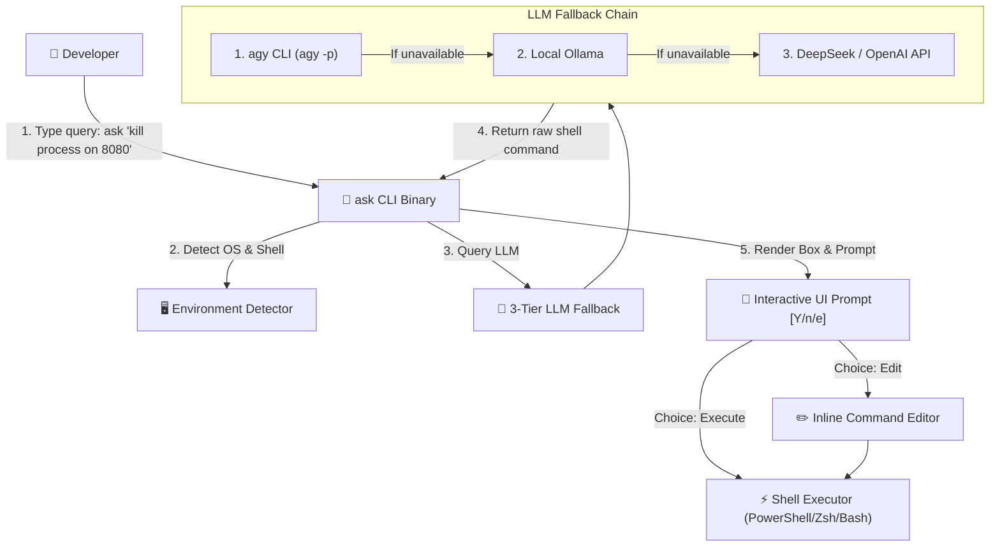

# 🤖 `ask`: Natural Language Shell CLI Assistant

> Turn plain English/Traditional Chinese into exact, executable shell commands directly in your terminal. Zero local Rust toolchain required — powered by automated GitHub Actions cross-compilation.


---

## 🌟 Key Features

* **⚡ Ultra-Fast & Zero Runtime Dependencies**: Compiled as a native single binary (<10ms startup time). No Node.js or Python runtime needed!
* **🧠 3-Tier LLM Provider Fallback**:
  1. **Antigravity CLI (`agy`)**: Seamlessly hooks into your local `agy` session without managing API keys!
  2. **Local Ollama**: 100% offline & privacy-first via local `qwen2.5-coder` or `llama3.2`.
  3. **Cloud API**: Fallback to DeepSeek API or OpenAI API via `DEEPSEEK_API_KEY` / `OPENAI_API_KEY`.
* **🖥️ OS & Shell Intelligence**: Automatically detects whether you are on **Windows (PowerShell)**, **macOS (Zsh)**, or **Linux (Bash)** and formats commands accordingly.
* **🛡️ Interactive Safety Confirmation**: View generated commands in high-contrast syntax highlighting, with options to **Execute (`[Y]`)**, **Edit inline (`[e]`)**, or **Cancel (`[n]`)**.
* **📦 Automatic Binary Delivery**: Built and compiled for Windows (`.exe`), macOS, and Linux via GitHub Actions CI/CD.

---

## 🏗️ System Architecture



---

## 🚀 Quick Start & Installation

### Option 1: Download Pre-compiled Binary (Recommended)

You do **NOT** need Rust installed on your machine!

1. Go to the [Releases](https://github.com/your-username/ask/releases) page of this repository.
2. Download the binary matching your operating system:
   * **Windows**: Download `ask-windows-amd64.exe` (rename to `ask.exe` and place in your System PATH).
   * **macOS (Apple Silicon)**: Download `ask-macos-arm64`.
   * **Linux**: Download `ask-linux-amd64`.

### Option 2: Build from Source (If you have Cargo installed)

```bash
git clone https://github.com/your-username/ask.git
cd ask
cargo build --release
```

---

## 💡 Command Examples

### 1. Process Management
```bash
ask "找出佔用 8080 埠號的程序並把它砍掉"
```
**Generated Output (Windows PowerShell):**
```powershell
Get-Process -Id (Get-NetTCPConnection -LocalPort 8080).OwningProcess | Stop-Process -Force
```

### 2. Git Workflow
```bash
ask "幫我把最近 3 個 commit 合併成一個"
```
**Generated Output:**
```bash
git rebase -i HEAD~3
```

### 3. Media & File Compression
```bash
ask "把所有的 pdf 檔案找出並依據大小降序排列"
```
**Generated Output:**
```bash
Get-ChildItem -Path . -Filter *.pdf | Sort-Object Length -Descending
```

---

## ⚙️ Configuration & Environment Variables

| Variable | Description | Default |
| :--- | :--- | :--- |
| `OLLAMA_HOST` | Custom Ollama host URL | `http://localhost:11434` |
| `OLLAMA_MODEL` | Custom Ollama model name | `qwen2.5-coder:latest` |
| `DEEPSEEK_API_KEY` | DeepSeek API Key for Cloud Fallback | None |
| `OPENAI_API_KEY` | OpenAI API Key for Cloud Fallback | None |

---

## 📄 License

MIT License © 2026 Your Name
