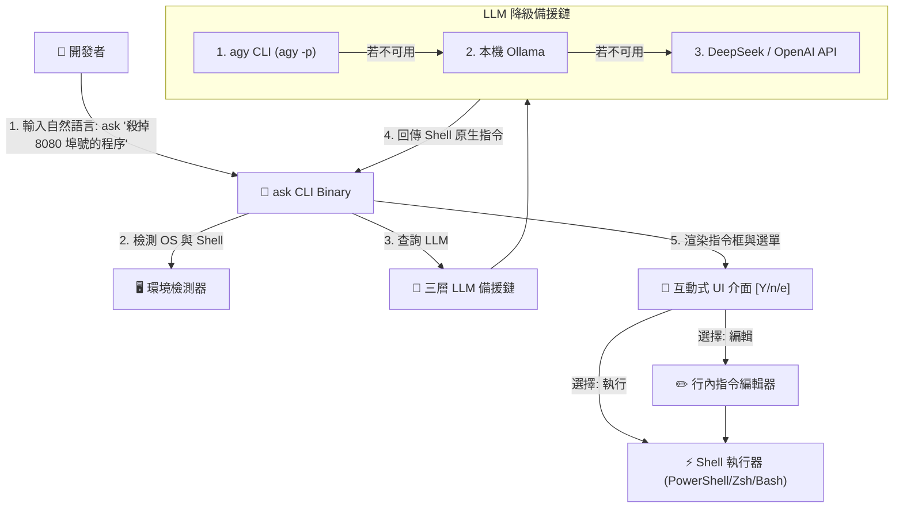

# 🤖 `ask`: 自然語言 Shell 終端機 AI 助手 CLI

> 將自然語言（繁體中文 / 英文）直接轉化為精準、可執行的 Shell 指令。本機無需安裝 Rust 編譯環境 — 由 GitHub Actions 全自動跨平台編譯提供。

[ English ](README.md) | [ 繁體中文 ](README_zh-TW.md)


---

## 🌟 核心特色

* **⚡ 極速與零運行時依賴**：編譯為原生單一二進位檔（<10ms 啟動時間）。完全不需要 Node.js 或 Python 執行環境！
* **🧠 三層 LLM Provider 自動降級備援**：
  1. **Antigravity CLI (`agy`)**：自動對接本機 `agy` 會話，免手動配置 API Keys！
  2. **本機 Ollama**：離線與隱私優先，透過本機 `qwen2.5-coder` 或 `llama3.2` 運算。
  3. **線上 Cloud API**：本機未開時自動降級至 DeepSeek API 或 OpenAI API (`DEEPSEEK_API_KEY` / `OPENAI_API_KEY`)。
* **🖥️ 作業系統與 Shell 自動識別**：自動識別您目前處於 **Windows (PowerShell)**、**macOS (Zsh)** 或 **Linux (Bash)**，並格式化為對應的 Shell 語法。
* **🛡️ 互動式安全執行確認**：高亮展示生成的指令，並提供 **立即執行 (`[Y]`)**、**行內編輯 (`[e]`)** 或 **取消 (`[n]`)** 的互動式選單。
* **📦 GitHub Actions 全自動編譯發佈**：透過 CI/CD 流水線全自動產出 Windows (`.exe`)、macOS 與 Linux 可執行檔。

---

## 🏗️ 系統架構圖



---

## 🚀 快速開始與安裝說明

### 方式一：下載預編譯好的執行檔（推薦，免安裝 Rust）

您**不需要**在電腦上安裝 Rust！

1. 前往本專案的 [Releases](https://github.com/BingFengHung/ask/releases) 頁面或 Actions 頁面。
2. 根據您的作業系統下載對應二進位檔：
   * **Windows**：下載 `ask-windows-amd64.exe`（可重命名為 `ask.exe` 並加入系統 PATH）。
   * **macOS (Apple Silicon)**：下載 `ask-macos-arm64`。
   * **Linux**：下載 `ask-linux-amd64`。

### 方式二：從原始碼自行編譯（需安裝 Cargo）

```bash
git clone https://github.com/BingFengHung/ask.git
cd ask
cargo build --release
```

---

## 💡 使用範例 (Command Examples)

### 1. 進程與埠號管理
```bash
ask "找出佔用 8080 埠號的程序並把它砍掉"
```
**生成的 PowerShell 指令：**
```powershell
Get-Process -Id (Get-NetTCPConnection -LocalPort 8080).OwningProcess | Stop-Process -Force
```

### 2. Git 工作流
```bash
ask "幫我把最近 3 個 commit 合併成一個"
```
**生成的 Shell 指令：**
```bash
git rebase -i HEAD~3
```

### 3. 多媒體與檔案過濾
```bash
ask "把所有的 pdf 檔案找出並依據大小降序排列"
```
**生成的 PowerShell 指令：**
```powershell
Get-ChildItem -Path . -Filter *.pdf | Sort-Object Length -Descending
```

---

## ⚙️ 環境變數與進階設定

| 環境變數 | 說明 | 預設值 |
| :--- | :--- | :--- |
| `OLLAMA_HOST` | 自訂 Ollama 服務位址 | `http://localhost:11434` |
| `OLLAMA_MODEL` | 自訂 Ollama 模型名稱 | `qwen2.5-coder:latest` |
| `DEEPSEEK_API_KEY` | DeepSeek API Key（雲端備援） | 無 |
| `OPENAI_API_KEY` | OpenAI API Key（雲端備援） | 無 |

---

## 🛣️ 未來開發規劃 (Roadmap)

- [ ] **🛡️ 高風險指令資安防護 (Dangerous Command Guardrails)**：整合即時風險評估器，針對破壞性操作（如 `rm -rf`, `DROP DATABASE`, `format`）標示高亮 `[DANGER]` 警告並強制二次手動確認。
- [ ] **📖 `ask explain` 反向指令解釋模式**：新增指令反向剖析功能（`ask explain "<指令>"`），將複雜的 Bash 管道與 PowerShell Cmdlet 拆解為易懂的步驟教學。
- [ ] **🧠 上下文對話記憶 (Multi-Turn Session Memory)**：實作本機輕量狀態持久化 (`~/.ask/session.json`)，支援連貫語意追問（如 `ask "把它殺掉"` 或 `ask "將剛才的結果備份"`）。
- [ ] **⚡ Shell 一鍵快捷鍵整合 (`ask install`)**：自動將 `??` 或 `q` 快捷別名寫入 `.zshrc`、`.bashrc` 與 PowerShell `$PROFILE` 檔案中。
- [ ] **🔍 本機工具鏈動態感應**：啟動時自動掃描本機已安裝的 CLI 工具（`docker`, `git`, `ffmpeg`, `jq`），並注入 Prompt 確保 LLM 產出 100% 可執行的指令。

---

## 📄 開源授權

MIT License © 2026 BingFengHung
